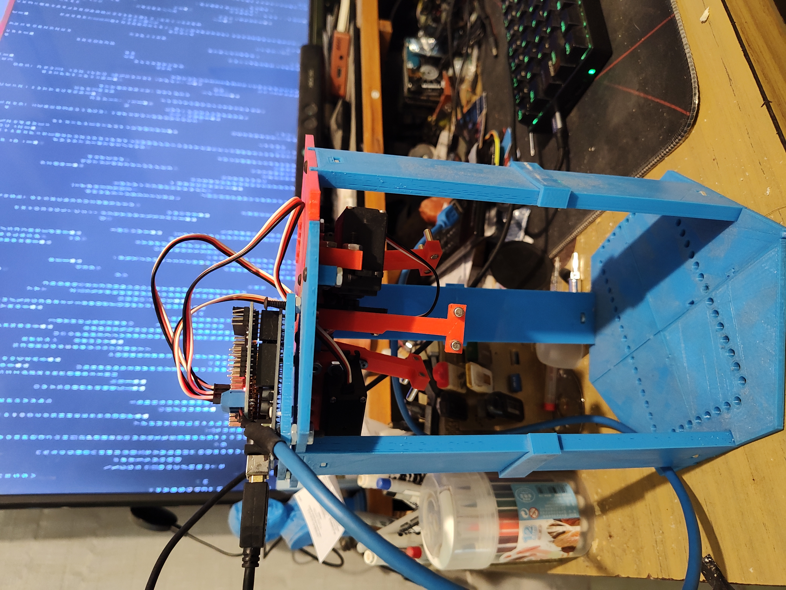

# Hardware Test Setup - Tapsterbot

Este documento describe cómo conectar el hardware y preparar el entorno para realizar pruebas básicas con los servos de Tapsterbot.

## Requisitos

### Hardware

- 3x Servomotores (como SG90 o MG90S)
- 1x Arduino Uno
- 1x Sensor Shield v5.0 para Arduino
- 1x Fuente de alimentación externa (5V, mínimo 2A recomendados)
- 1x Cable USB para conectar el Arduino a la PC
- Cables Dupont (opcional, si tu shield no tiene conectores estándar)

### Software

- Node.js (v18 o superior recomendado)
- npm (gestor de paquetes de Node.js)

## Importante

### ⚡ Aislar la alimentación de servos en el Sensor Shield v5.0

Al utilizar el Sensor Shield v5.0 con Arduino UNO, es fundamental evitar que los servos reciban corriente desde el puerto USB de la computadora. Esto puede sobrecargar el USB e incluso dañar el equipo.

### ✅ Verificación rápida

1. Conectá el Sensor Shield al Arduino UNO.
2. Conecta el Arduino UNO por USB a un puerto USB.
3. Conectá una fuente externa de 5V al conector de alimentación del Shield (normalmente un jack o bornes de tornillo).
4. Verificá que el LED **PWR** del Shield esté encendido (esto es normal).
5. **Desconectá la fuente externa del Shield.**
6. Si el LED **PWR sigue encendido**, significa que los pines de alimentación del Shield están conectados al pin de 5V del Arduino, y por lo tanto **los servos recibirán corriente desde el USB, esto es un problema** ⚠️.

### 🛠 Solución: Desconectar el pin de 5V

Para aislar la alimentación de los servos del pin de 5V del Arduino, hacé lo siguiente:

1. Identificá el pin de **5V** en el conector macho del Sensor Shield (donde se conecta al Arduino UNO).
2. **Desoldá ese pin** o calentalo y levantalo para que no haga conectato en el Arduino UNO

Esto aisla la alimentacion del Arduino UNO con la alimentación del Sensor Shield evitando así que los servos se alimenten por el USB.

> 💡 Después del cambio, al repetir el test anterior, al desconectar la fuente externa el LED **PWR del Shield debe apagarse**. Esa es la señal de que las alimentaciones están correctamente aisladas.

---

### 🧠 ¿Por qué es importante esto?

- Los servos pueden consumir más corriente de la que el USB puede entregar.
- Alimentar varios servos desde el USB puede causar reinicios, mal funcionamiento o incluso dañar el puerto USB.
- Con este pequeño ajuste, el Arduino sigue funcionando normalmente y solo los servos usan la fuente externa.

---

## Conexión de los servos

1. Conectá los tres servos a los pines `D9`, `D10` y `D11` del sensor shield.
2. Asegurate de respetar la polaridad: `GND`, `VCC`, `SIGNAL`.
3. Montar solo los brazos superiores de la plataforma para poder verificar que se mueven.

---

## Probando el Hardware

### Instalar dependencias

npm init -y
npm install johnny-five
npm install johnny-five keypress

## Ejecutar script de prueba

node servos_tests.js

## Verificar

Si todo fue bien dberias ser capaz de mover los brazos de los servos indivualmente y ejecutar las demos que mueven los 3 brazos en simultaneo y esos movimientos deben ser fluidos.

## Agregar Troubleshooting

1. Problema de aliemtnacion de servos
2. Problema de conexion Arduino-PC (cable/puerto)
