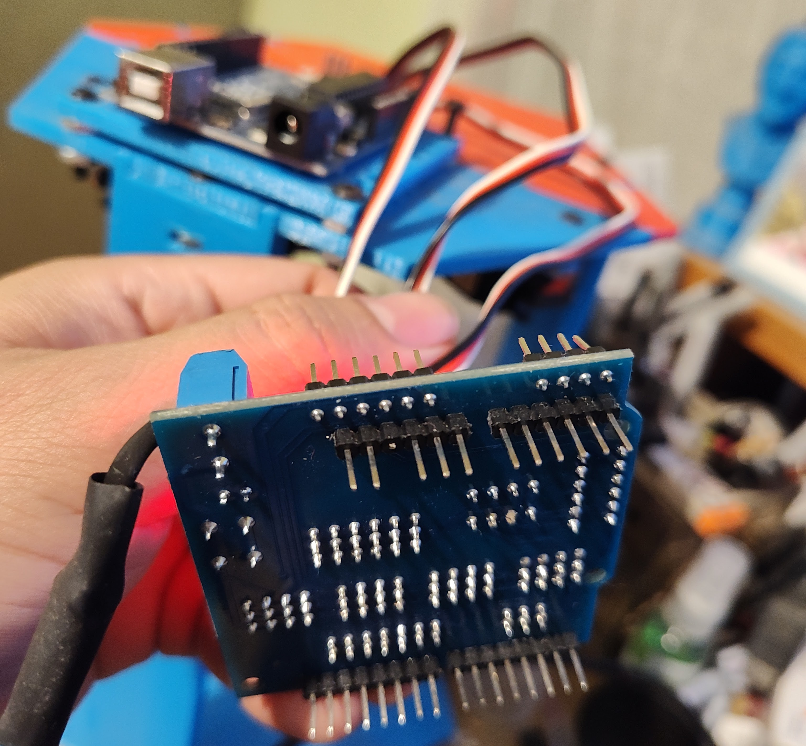
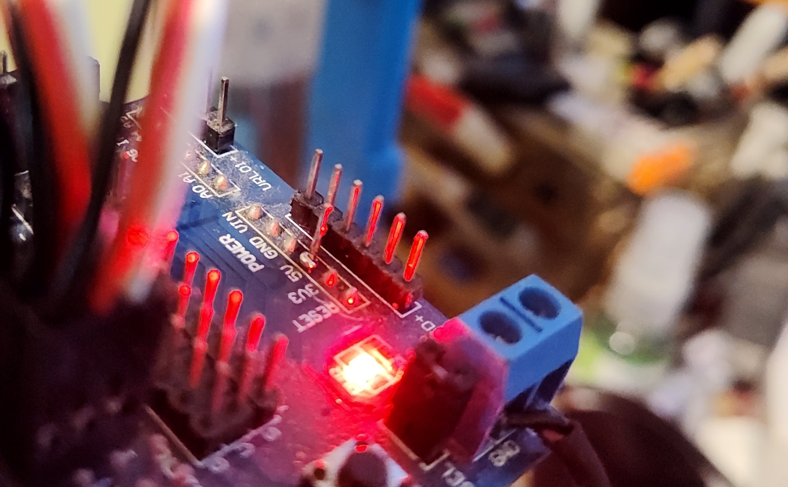

# ⚡ Aislar la alimentación de servos en el Sensor Shield v5.0

Al utilizar el Sensor Shield v5.0 con Arduino UNO, es fundamental evitar que los servos reciban corriente desde el puerto USB de la computadora. Esto puede sobrecargar el USB e incluso dañar el equipo.

## ✅ Verificación rápida

1. Conectá el Sensor Shield al Arduino UNO.
2. Conecta el Arduino UNO por USB a un puerto USB.
3. Conectá una fuente externa de 5V al conector de alimentación del Shield (normalmente un jack o bornes de tornillo).
4. Verificá que el LED **PWR** del Shield esté encendido (esto es normal).
5. **Desconectá la fuente externa del Shield.**
6. Si el LED **PWR sigue encendido**, significa que los pines de alimentación del Shield están conectados al pin de 5V del Arduino, y por lo tanto **los servos recibirán corriente desde el USB, esto es un problema** ⚠️.

## 🛠 Solución: Desconectar el pin de 5V

Para aislar la alimentación de los servos del pin de 5V del Arduino, hacé lo siguiente:

1. Identificá el pin de **5V** en el conector macho del Sensor Shield (donde se conecta al Arduino UNO).
2. **Desoldá ese pin** o calentalo y levantalo para que no haga conectato en el Arduino UNO

Esto aisla la alimentacion del Arduino UNO con la alimentación del Sensor Shield evitando así que los servos se alimenten por el USB.

> 💡 Después del cambio, al repetir el test anterior, al desconectar la fuente externa el LED **PWR del Shield debe apagarse**. Esa es la señal de que las alimentaciones están correctamente aisladas.

---

## 🧠 ¿Por qué es importante esto?

- Los servos pueden consumir más corriente de la que el USB puede entregar.
- Alimentar varios servos desde el USB puede causar reinicios, mal funcionamiento o incluso dañar el puerto USB.
- Con este pequeño ajuste, el Arduino sigue funcionando normalmente y solo los servos usan la fuente externa.

---

## 🧪 Tip adicional

Después de aplicar el cambio, podés probar con el script `servos_tests.js` para verificar que todo funcione bien con alimentación externa.
